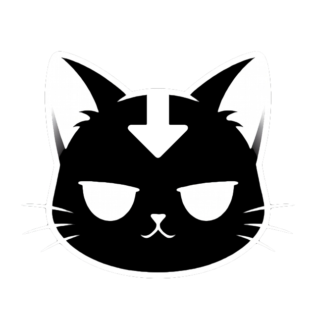

<p align="center">
  
</p>

<h1 align="center">Pawload</h1>

<p align="center">
  <strong>Your paw-powered media downloader</strong>
</p>

<p align="center">
  A clean, ad-free frontend for downloading videos, audio and images from social media platforms.<br>
  Powered by <a href="https://github.com/imputnet/cobalt">Cobalt</a> API.
</p>

## English

### Features

- **22+ platforms** - Twitter/X, Instagram, TikTok, Reddit, SoundCloud, Pinterest, Bluesky, Vimeo and more
- **No ads, no tracking** - clean and privacy-friendly
- **Preview before download** - watch/listen/view before saving
- **Download settings** - video quality, codec, audio format, bitrate, metadata control
- **Bilingual** - Turkish and English, switchable in one click
- **Interactive mascot** - a grumpy cat with 100+ random lines
- **Customizable dialogs** - edit `mascot.json` to add your own lines
- **Mobile-first** - fully responsive, PWA-ready
- **Secure** - XSS protection, CSP headers, URL validation, no exposed API keys
- **Self-hosted** - your API URL stays hidden behind nginx reverse proxy

### Supported Platforms

Bilibili, Bluesky, Dailymotion, Facebook, Instagram, Loom, Newgrounds, OK, Pinterest, Reddit, Rutube, Snapchat, SoundCloud, Streamable, TikTok, Tumblr, Twitch, Twitter/X, Vimeo, VK, Xiaohongshu

> YouTube is currently blocked due to bot protection. We're working on it.

### Quick Start

**Prerequisites:** Docker, a running [Cobalt](https://github.com/imputnet/cobalt) API instance.

```bash
git clone https://github.com/kemalasliyuksek/pawload.git
cd pawload
```

Edit `docker-compose.yml` and set your Cobalt API URL:

```yaml
environment:
  COBALT_API_URL: "https://your-cobalt-instance.example.com"
```

Build and run:

```bash
docker compose up -d
```

Open `http://localhost:9002` in your browser.

### Configuration

| Variable | Description | Default |
|----------|-------------|---------|
| `COBALT_API_URL` | Your Cobalt API instance URL | Required |
| Port mapping | Container port 80 mapped to host | `9002:80` |

**Mascot dialogs:** Edit `mascot.json` to customize the cat's lines. Supports any number of languages with `tr` and `en` included by default.

**Download settings:** Users can configure video quality, codec, audio format, bitrate, and metadata options via the settings menu. Preferences are saved in `localStorage`.

### Project Structure

```
pawload/
├── index.html              # Main page
├── css/style.css           # Styles and animations
├── js/app.js               # Application logic + i18n
├── mascot.json             # Customizable mascot dialogs
├── assets/                 # Logo and favicon
├── nginx.conf.template     # Nginx config with API proxy
├── Dockerfile              # Container build
├── docker-compose.yml      # Deployment config
├── robots.txt              # Search engine opt-out
└── .gitignore
```

### Security

- All dynamic content is sanitized against XSS (`escapeHTML`, `escapeAttr`)
- All download URLs validated (`isSafeURL` - http/https only)
- Content Security Policy restricts all resource sources
- Nginx hides server version, blocks hidden files
- API URL is never exposed in client-side code
- `robots.txt` prevents search engine indexing

## Türkçe

### Özellikler

- **22+ platform** - Twitter/X, Instagram, TikTok, Reddit, SoundCloud, Pinterest, Bluesky, Vimeo ve daha fazlası
- **Reklamsız, takipsiz** - temiz ve gizliliğe saygılı
- **İndirmeden önce önizleme** - kaydetmeden önce izle/dinle/gör
- **İndirme ayarları** - video kalitesi, codec, ses formatı, bitrate, metadata kontrolü
- **İki dilli** - Türkçe ve İngilizce, tek tıkla değiştir
- **Etkileşimli maskot** - 100'den fazla rastgele replikle somurtan bir kedi
- **Özelleştirilebilir diyaloglar** - `mascot.json` dosyasını düzenleyerek kendi repliklerini ekle
- **Mobil öncelikli** - tamamen responsive, PWA uyumlu
- **Güvenli** - XSS koruması, CSP header'ları, URL doğrulama, API anahtarı ifşa edilmez
- **Self-hosted** - API URL'in nginx reverse proxy arkasında gizli kalır

### Desteklenen Platformlar

Bilibili, Bluesky, Dailymotion, Facebook, Instagram, Loom, Newgrounds, OK, Pinterest, Reddit, Rutube, Snapchat, SoundCloud, Streamable, TikTok, Tumblr, Twitch, Twitter/X, Vimeo, VK, Xiaohongshu

> YouTube şu anda bot koruması nedeniyle desteklenmiyor. Üzerinde çalışıyoruz.

### Hızlı Başlangıç

**Gereksinimler:** Docker, çalışan bir [Cobalt](https://github.com/imputnet/cobalt) API instance'ı.

```bash
git clone https://github.com/kemalasliyuksek/pawload.git
cd pawload
```

`docker-compose.yml` dosyasını düzenle ve Cobalt API URL'ini ayarla:

```yaml
environment:
  COBALT_API_URL: "https://senin-cobalt-instancein.example.com"
```

Derle ve çalıştır:

```bash
docker compose up -d
```

Tarayıcıda `http://localhost:9002` adresini aç.

### Yapılandırma

| Değişken | Açıklama | Varsayılan |
|----------|----------|------------|
| `COBALT_API_URL` | Cobalt API instance URL'in | Zorunlu |
| Port eşleme | Container port 80, host'a eşle | `9002:80` |

**Maskot diyalogları:** Kedinin repliklerini özelleştirmek için `mascot.json` dosyasını düzenle. Varsayılan olarak `tr` ve `en` dahil, istediğin dili ekleyebilirsin.

**İndirme ayarları:** Kullanıcılar ayarlar menüsünden video kalitesi, codec, ses formatı, bitrate ve metadata seçeneklerini yapılandırabilir. Tercihler `localStorage`'da saklanır.

### Proje Yapısı

```
pawload/
├── index.html              # Ana sayfa
├── css/style.css           # Stiller ve animasyonlar
├── js/app.js               # Uygulama mantığı + i18n
├── mascot.json             # Özelleştirilebilir maskot diyalogları
├── assets/                 # Logo ve favicon
├── nginx.conf.template     # API proxy'li Nginx yapılandırması
├── Dockerfile              # Container derlemesi
├── docker-compose.yml      # Dağıtım yapılandırması
├── robots.txt              # Arama motoru engeli
└── .gitignore
```

### Güvenlik

- Tüm dinamik içerik XSS'e karşı sanitize edilir (`escapeHTML`, `escapeAttr`)
- Tüm indirme URL'leri doğrulanır (`isSafeURL` - yalnızca http/https)
- Content Security Policy tüm kaynakları kısıtlar
- Nginx sunucu sürümünü gizler, gizli dosyaları engeller
- API URL'i istemci tarafında asla ifşa edilmez
- `robots.txt` arama motoru indexlemeyi engeller

## License

MIT

<p align="center">
  Made with 🐾 by <a href="https://github.com/kemalasliyuksek">Kemal Aslıyüksek</a>
</p>
